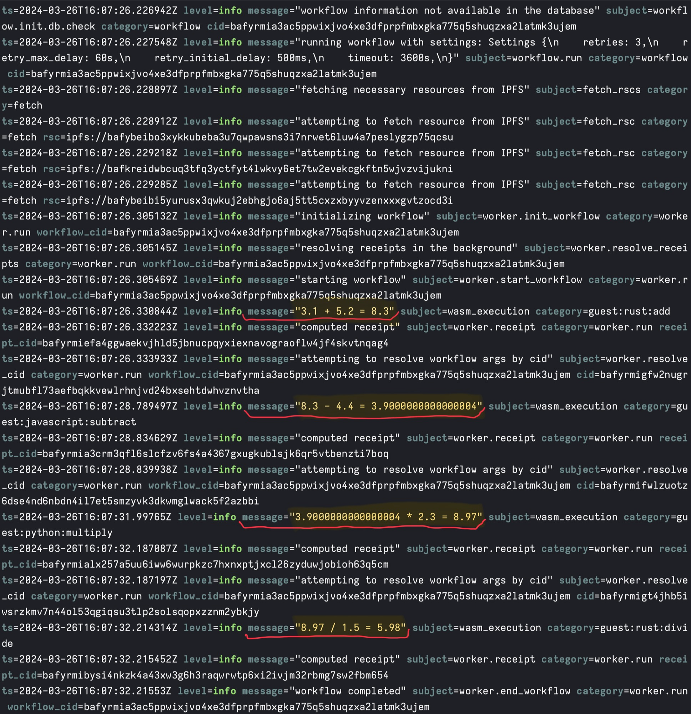

[Everywhere Computer][everywhere-comp] is a compute platform for [InterPlanetary Virtual Machine (IPVM)][ipvm] workflows. The Homestar runtime implements IPVM and runs compute in the Everywhere Computer.

Homestar runs Wasm-based [workflows][workflows] where Wasm components provide functions to execute. Wasm components can be authored in [various languages][wit-guest][^1], but we'll focus primarily on Rust, JavaScript, and Python for this post. Reading ahead, we'll be writing functions in each of these languages, compiling them to Wasm, packaging them as [Wasm components][wasm-component], and bringing them together into a workflow that will
be executed on our computer platform.

Our goal is to introduce authoring functions for Everywhere Computer. Along the way, we'll introduce Wasm component tooling, the Homestar runtime, and Every CLI which composes Homestar and a gateway for managing Wasm components and preparing workflows.

### Wasm components, WIT, and WASI logging

#### Wasm Components

- Why?
- Bytecodealliance work on components
- We'll use their tooling for writing components
- We also use their Wasmtime in Homestar!

#### WIT

- Describe Wasm component interfaces
- Consistent interface implemented by our source languages
- Has it's own type system

#### WASI logging

- Introduce WASI
- Homestar acts as a host that implements WASI logging
- Our functions log messages that are displayed by Homestar
- Can use for logging information or reporting errors

### Our functions

We will write arithmetic operations in each language to keep our example code simple and straightforward. We will use division to show division by zero error reporting.

Our Rust program will perform addition and division; the JavaScript one will perform subtraction; and, the Python program will carry out multiplication.

Our functions will be compiled to Wasm components using tools from or built upon the excellent work from the [Bytecode Alliance][bytecode-alliance]. The Wasm component ecosystem is evolving quickly, so keep in mind that the techniques described in this blog post may be out of date already. We'll provide links so you can check on the latest developments.

#### Rust

- Explain cargo component
- Show testing functions with wasmtime
- Details...

#### JavaScript

For JavaScript, we use [Homestar Wasmify][homestar-client] to generate a Wasm component. Wasmify is our project to infer WIT types from TypeScript and include WASI dependencies automatically. This project is quite new and only implements a subset of TypeScript types. Also, Wasmify is a bit of a placeholder name that we may replace.

Our TypeScript source code subtracts two numbers and logs the operation:

```typescript
import { log } from "wasi:logging/logging";

export function subtract(a: number, b: number): number {
  const result = a - b;

  log("info", "guest:javascript:subtract", `${a} - ${b} = ${result}`);

  return result;
}
```

Building a Wasm component from this source code calls Wasmify `build`:

```javascript
import { build } from "@fission-codes/homestar/wasmify";

await build({
  entryPoint: "src/subtract.ts",
  outDir: "output",
});
```

Running this script will produce a Wasm component with a `subtract` name prefix and a hash, for example `subtract-j54di3rspj2eewjro4.wasm`.

Wasmify is built on top of [ComponentizeJS][componentize-js] which ingests JavaScript source code and embeds SpiderMonkey in a Wasm component to run it. Embedding SpiderMonkey and running JavaScript code comes at a size and perfomance cost compared to languages that can compile to WebAssembly directly, but it is necessary to provide a JavaScript environment.

See [Making JavaScript run fast on WebAssembly][javascript-webassembly-post] for more information.

#### Python

https://www.youtube.com/watch?v=PkAO17lmqsI

Around 15 minutes, ships CPython, libc and more

- Words...

### IPFS

Homestar and Everywhere Computer currently uses IPFS as a storage layer. Before we start into the next section, [install IPFS Kubo][install-ipfs] and start the IPFS daemon:

```sh
ipfs daemon
```

The daemon should run on the default `5001` port.

### Workflows

We now have a set of Wasm components with arithmetic functions sourced from multiple languages. Our next step is to run these functions in [workflows][workflows].

Every CLI starts a gateway that loads Wasm components, prepares workflows, and calls on the Homestar runtime to schedule and execute them. [Install Every CLI][install-every-cli], then we'll write a workflow.

The workflows that Homestar runs are a bit challenging to write by hand directly, so Every CLI provides a simplfied workflow syntax that it uses to prepare the underlying workflow. Let's start by using `math.wasm` to add two numbers:

```json
{
  "tasks": [
    {
      "run": {
        "name": "add",
        "input": {
          "args": [3.1, 5.2],
          "func": "add"
        }
      }
    }
  ]
}
```

A workflow is an array of tasks that we would like to execute. Each task is given a `name` which will be used to reference results in subsequent tasks. Our task `input` includes the name of the function to execute and the arguments to the function.

Let's run this workflow! Start Every CLI with `math.wasm` as an argument:

```sh
every dev --fn rust/target/wasm32-wasi/release/math.wasm
```

Every CLI starts a gateway that we can query for a JSON Schema representing the WIT interfaces in `math.wasm` at `localhost:3000`.

Post the workflow to the gateway:

```sh
curl localhost:3000/run --json @workflows/add.json
```

The response reports the result of adding `3.1` and `5.2` as `8.3`.

In addition, Every CLI has passed along logs from the Homestar runtime:


The logs report information about workflow execution and include our WASI logs. Our WASI log reports `"3.1 + 5.2 = 8.3"` with the category `guest:rust:add`. WASI logs always have the `wasm_execution` subject.

We can also see workflow settings, fetching resources (our Wasm components), intializing, starting, and completing the workflow. The resolving receipts log shows that Homestar is looking for cached results so it can avoid work where possible. The computed receipt log reports the [CID][cid], a content identifier derived on the content's cryptographic hash and which points to material on IPFS, of the receipt from the add computation. Every CLI returns the workflow result, but the computed receipts can be also used to pull results directly from IPFS by CID.

If we post the workflow to the gateway again, we see a different set of logs:


This time we don't need to do any work. Homestar cached the receipts from our last run, and reports that it is replaying the workflow and its receipts.

Notice also that our WASI log does not show up. WASI logs only happen on execution, not replay. We'll see in a moment how we can force re-execution to always see WASI logs.

Let's try a workflow that uses all four arithmetic operations from our Rust, JavaScript, and Python sourced components:

```json
{
  "tasks": [
    {
      "run": {
        "name": "add",
        "input": {
          "args": [3.1, 5.2],
          "func": "add"
        }
      }
    },
    {
      "run": {
        "name": "subtract",
        "input": {
          "args": ["{{needs.add.output}}", 4.4],
          "func": "subtract"
        }
      }
    },
    {
      "run": {
        "name": "multiply",
        "input": {
          "args": ["{{needs.subtract.output}}", 2.3],
          "func": "multiply"
        }
      }
    },
    {
      "run": {
        "name": "divide",
        "input": {
          "args": ["{{needs.multiply.output}}", 1.5],
          "func": "divide"
        }
      }
    }
  ]
}
```

In this workflow, each task except the first receives an input from the previous task. For example, `subtract` awaits the output of `add` by using `"{{needs.add.output}}"` as a placeholder that will be filled in when `add` has completed.

Restart Every CLI, passing in all of our Wasm components:

```sh
every dev --fn rust/target/wasm32-wasi/release/math.wasm --fn javascript/output/subtract-j54di3rspj2eewjro4.wasm --fn python/output/multiply.wasm --debug
```

The hash of your subtract Wasm component may be different. Check `javascript/output` for the appropriate file name.

We use the `--debug` flag this time to force re-execution of the tasks in our workflow. The `--debug` flag lets us see our WASI logs on every run while we are developing our functions, but should not be used in production because it eliminates the benefits of caching.

Post this workflow:

```sh
curl localhost:3000/run --json @workflows/all.json
```

The response reports a result of `5.98` which looks close enough for computer math!

Our WASI logging reports each operation:



We can see WASI logs from each of our components, labeled by category as `guest:rust:add`, `guest:javascript:subtract`, `guest:python:multiply`, and `guest:rust:divide`.

Lastly, a workflow that attempts division by zero to check our error reporting.

```json
{
  "tasks": [
    {
      "run": {
        "name": "divide",
        "input": {
          "args": [3.1, 0.0],
          "func": "divide"
        }
      }
    }
  ]
}
```

On running this workflow, we see two errors:


The first error is our WASI log reporting a "Division by zero error". The second error is an execution error from the Wasm runtime. It's a bit inscutable, but we can see "not able to run fn divide" which tells us which function failed.

### Everywhere Computer Control Panel

You may have noticed `every-cli` starts a Control Panel:


We have a web UI in progress that we will discuss in a future post.

[^1]: Other supported languages include C/C++, Java (TeaVM Java), Go (TinyGo), and C#

[bytecode-alliance]: https://bytecodealliance.org/
[cid]: https://docs.ipfs.tech/concepts/content-addressing/
[componentize-js]: https://github.com/bytecodealliance/ComponentizeJS
[homestar-client]: https://www.npmjs.com/package/@fission-codes/homestar
[everywhere-comp]: https://everywhere.computer/
[install-every-cli]: https://www.npmjs.com/package/@everywhere-computer/every-cli
[install-ipfs]: https://docs.ipfs.tech/install/command-line/#install-official-binary-distributions
[javascript-webassembly-post]: https://bytecodealliance.org/articles/making-javascript-run-fast-on-webassembly
[ipvm]: https://fission.codes/ecosystem/ipvm/
[wit-guest]: https://github.com/bytecodealliance/wit-bindgen?tab=readme-ov-file#supported-guest-languages
[wasm-component]: https://component-model.bytecodealliance.org/
[workflows]: https://aws.amazon.com/what-is/workflow/
