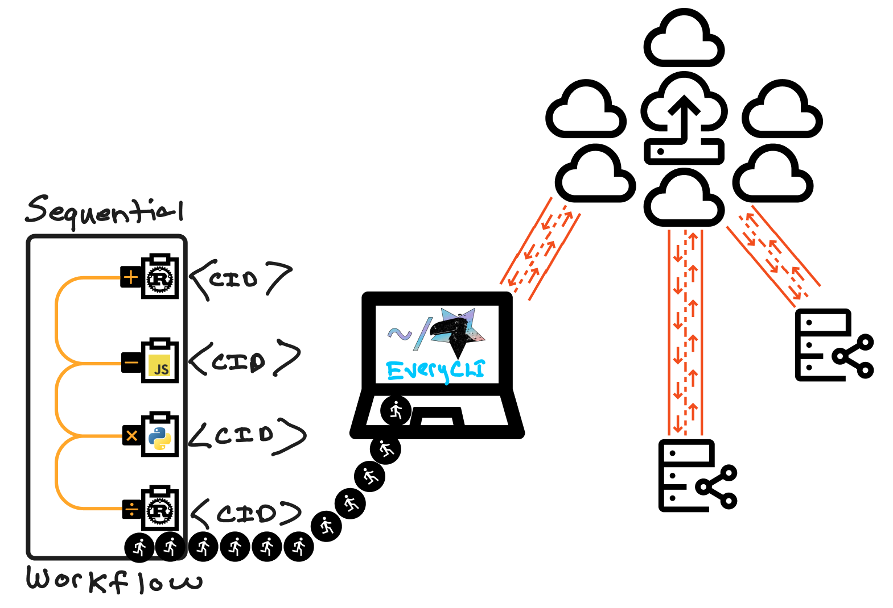

# Writing Functions for the Everywhere Computer

This post was published on the [Fission][fission-blog] blog.

_Authors_: [Brian Ginsburg][bgins] and [Zeeshan Lakhani][zeeshan-lakhani]

---

The [Everywhere Computer][everywhere-comp] is an emerging decentralized platform that aims to distribute computational tasks across a vast, open network. This network spans from your personal machine to other devices on your LAN, a cluster of cloud nodes, and even to PoPs (points of presence) located at the edge of the Internet. Processing happens as close to the data source as possible, scheduled on nodes with general capacity or those with specialized capabilities like high-powered CPUs or GPUs.

At its core, the Everywhere Computer is built on the [InterPlanetary Virtual Machine (IPVM)][ipvm] protocol. It executes workflows containing tasks that are content-addressed&mdash;which means they're uniquely identified by their content rather than by their location. This system is powered by nodes running Fission's [Homestar runtime][homestar-runtime], an engine that runs WebAssembly (Wasm) based workflows composed of [Wasm components][wasm-component] with runnable functions that can be scheduled and executed by any Homestar peer throughout the network.

Beyond the sandboxing, portability, and predictable performance benefits of Wasm, we're excited about orchestrating workflows and state machines composed of modules compiled from different source languages and bringing them together into workflows where the output of one task feeds into the input of another. Composing components in a workflow lets users focus on component interfaces without considering interactions between multiple languages.



With the Everywhere Computer, we're all in on "[the return of write once, run anywhere][write-once-run]" as a motto, but with content-addressing and our focus on caching and replayability of previously computed tasks, we can go a step further and say:

<blockquote>
Write once, run once, and never again (everywhere!)
</blockquote>

This post will introduce authoring Wasm components and functions for the Everywhere Computer. Wasm components can be written in [several of different programming languages][wit-guest]&mdash;including C/C++, Java (TeaVM Java), Go (TinyGo), and C#&mdash;but we'll focus on Rust, JavaScript, and Python for this post. We'll be writing functions in each of these languages, compiling and packaging them as Wasm components, and bringing them together into a workflow that executes on our compute platform. Along the way, we'll introduce Wasm component tooling, the Homestar runtime, and [EveryCLI][everycli], which provides a convenient interface for running Homestar with a gateway for preparing and executing workflows.

The Everywhere Computer is in beta. The [GitHub repositories][ec-gh] and [docs][ec-docs] are publicly available and open-source licensed, but we have a closed beta group to provide high-quality support and to gather feedback. [Sign up][beta-signup] for the beta group. We would love to hear what you are working on and what ideas you have for using the Everywhere Computer!

The code covered in this post is available in the Github repository at [everywhere-computer/writing-functions-blogpost-2024][writing-functions-repo].

## Background: Wasm components, WIT, & WASI logging

Evolution within the Wasm ecosystem is happening at a wicked fast pace, particularly now that the [path to Wasm components][path-to-components] has been streamlined and standardized, module-to-module interop is trivial.

In the Everywhere Computer, we decided to use the [Canonical ABI][canonical-abi] to convert between the values and functions exposed by components written using the Component Model and those provided by [Core WebAssembly][core-wasm] modules instead of imposing a custom ABI upon our users. A component is just a wrapper around a core module that specifies its imports, internal definitions, and exports using interfaces defined with the [Wasm Interface Type (WIT)][wit] IDL format.

Unlike core modules, components may not export Wasm memory, reinforcing Wasm sandboxing and enabling interoperation between languages with different memory assumptions. For example, a component that relies on Wasm-GC (garbage collected) memory compiled from a dynamic language can seamlessly interact with a component compiled from a static language using linear memory.

The Everywhere Computer strives for [simplicity][simple-made-easy]. By adopting the Component model and its tooling (for example, [cargo-component][cargo-component] and [wit-bindgen][wit-bindgen]), we can run workflows combining components from different languages without handling arbitrary Wasm modules or introducing custom tooling, bindgens, or SDKs for our ecosystem.

In addition, while our Homestar runtime utilizes alternate formats as internal [intermediate representations][ir], by adopting WIT, we can [interpret][wit-to-ipld] between WIT values and other data models at runtime without exposing these internal formats to function writers.

### Embedding Wasmtime

The Homestar runtime embeds the [Wasmtime][wasmtime] runtime to execute Wasm components associated with tasks in a workflow. The Wasmtime runtime is built and maintained by the [Bytecode Alliance][bytecode-alliance]. It provides multi-language support and fine-grained configuration for CPU and memory usage.

Wasmtime is at the forefront of the Wasm ecosystem, which includes their support of the WebAssembly System Interface (WASI) stack that recently reached [WASI Preview 2][wasip2]. WASI gives library developers and implementers like us lower-level primitives for working with files, sockets, and HTTP with a stable set of common interfaces to build on.

Some of the other platforms and frameworks that have adopted Wasmtime include [wasmCloud][wasmcloud], [Spin][fermyon-spin], and [Fastly Compute][fastly-compute].

### WIT

In the following sections, we will use WIT interfaces to define the types of our functions and a [world][wit-world] to describe the imports and exports associated with each Wasm component. Then, we will implement the interfaces in Rust, JavaScript, and Python.

WIT provides built-in types, including primitives like signed/unsigned integer types, floats, strings, and more interesting and complex types like results, options, and lists. WIT also provides a way to define custom, user-defined types like records, variants, and enums. Homestar supports all of these WIT types internally (except [resources][wit-resources], which we do not permit in guest code) when translating between other formats and data structures.

### WASI Logging

EveryCLI reports logs executed by guest programs running on the Homestar host runtime. To emit log messages, Homestar implements the proposed [WASI logging WIT interface][wasi-logging] which exposes the `log` method to function writers for integration into their programs. As we'll demonstrate later in this post, when you call `log` in your guest code, EveryCLI will display logs in a console at a specified level of verbosity and with contextual information.

In addition, EveryCLI provides detailed information that reports workflow events and runtime execution errors.

## Writing Functions

We will write arithmetic operations in each source language to keep our example code simple. Our Rust program will perform addition and division, the JavaScript one will perform subtraction, and the Python program will perform multiplication. We will use division to show division by zero error reporting.

Our functions will be compiled into Wasm components using tools from or built upon the excellent work of the Bytecode Alliance. The Wasm component ecosystem is evolving quickly, so keep in mind that the techniques described in this blog post may be out of date. We'll provide links so you can check on the latest developments.

Clone the [writing-functions-blogpost-2024][writing-functions-repo] repository if you would like to follow along. The repository includes instructions for installing dependencies, tooling, and compiling components for each language. We will use [EveryCLI][everycli] to run workflows that call the functions in these compo# Writing Functions for the Everywhere Computer

This post was published on the [Fission][fission-blog] blog.

_Authors_: [Brian Ginsburg][bgins] and [Zeeshan Lakhani][zeeshan-lakhani]

---

The [Everywhere Computer][everywhere-comp] is an emerging decentralized platform that aims to distribute computational tasks across a vast, open network. This network spans from your personal machine to other devices on your LAN, a cluster of cloud nodes, and even to PoPs (points of presence) located at the edge of the Internet. Processing happens as close to the data source as possible, scheduled on nodes with general capacity or those with specialized capabilities like high-powered CPUs or GPUs.

At its core, the Everywhere Computer is built on the [InterPlanetary Virtual Machine (IPVM)][ipvm] protocol. It executes workflows containing tasks that are content-addressed&mdash;which means they're uniquely identified by their content rather than by their location. This system is powered by nodes running Fission's [Homestar runtime][homestar-runtime], an engine that runs WebAssembly (Wasm) based workflows composed of [Wasm components][wasm-component] with runnable functions that can be scheduled and executed by any Homestar peer throughout the network.

Beyond the sandboxing, portability, and predictable performance benefits of Wasm, we're excited about orchestrating workflows and state machines composed of modules compiled from different source languages and bringing them together into workflows where the output of one task feeds into the input of another. Composing components in a workflow lets users focus on component interfaces without considering interactions between multiple languages.


With the Everywhere Computer, we're all in on "[the return of write once, run anywhere][write-once-run]" as a motto, but with content-addressing and our focus on caching and replayability of previously computed tasks, we can go a step further and say:

<blockquote>
Write once, run once, and never again (everywhere!)
</blockquote>

This post will introduce authoring Wasm components and functions for the Everywhere Computer. Wasm components can be written in [several of different programming languages][wit-guest]&mdash;including C/C++, Java (TeaVM Java), Go (TinyGo), and C#&mdash;but we'll focus on Rust, JavaScript, and Python for this post. We'll be writing functions in each of these languages, compiling and packaging them as Wasm components, and bringing them together into a workflow that executes on our compute platform. Along the way, we'll introduce Wasm component tooling, the Homestar runtime, and [EveryCLI][everycli], which provides a convenient interface for running Homestar with a gateway for preparing and executing workflows.

The Everywhere Computer is in beta. The [GitHub repositories][ec-gh] and [docs][ec-docs] are publicly available and open-source licensed, but we have a closed beta group to provide high-quality support and to gather feedback. [Sign up][beta-signup] for the beta group. We would love to hear what you are working on and what ideas you have for using the Everywhere Computer!

The code covered in this post is available in the Github repository at [everywhere-computer/writing-functions-blogpost-2024][writing-functions-repo].

## Background: Wasm components, WIT, & WASI logging

Evolution within the Wasm ecosystem is happening at a wicked fast pace, particularly now that the [path to Wasm components][path-to-components] has been streamlined and standardized, module-to-module interop is trivial.

In the Everywhere Computer, we decided to use the [Canonical ABI][canonical-abi] to convert between the values and functions exposed by components written using the Component Model and those provided by [Core WebAssembly][core-wasm] modules instead of imposing a custom ABI upon our users. A component is just a wrapper around a core module that specifies its imports, internal definitions, and exports using interfaces defined with the [Wasm Interface Type (WIT)][wit] IDL format.

Unlike core modules, components may not export Wasm memory, reinforcing Wasm sandboxing and enabling interoperation between languages with different memory assumptions. For example, a component that relies on Wasm-GC (garbage collected) memory compiled from a dynamic language can seamlessly interact with a component compiled from a static language using linear memory.

The Everywhere Computer strives for [simplicity][simple-made-easy]. By adopting the Component model and its tooling (for example, [cargo-component][cargo-component] and [wit-bindgen][wit-bindgen]), we can run workflows combining components from different languages without handling arbitrary Wasm modules or introducing custom tooling, bindgens, or SDKs for our ecosystem.

In addition, while our Homestar runtime utilizes alternate formats as internal [intermediate representations][ir], by adopting WIT, we can [interpret][wit-to-ipld] between WIT values and other data models at runtime without exposing these internal formats to function writers.

### Embedding Wasmtime

The Homestar runtime embeds the [Wasmtime][wasmtime] runtime to execute Wasm components associated with tasks in a workflow. The Wasmtime runtime is built and maintained by the [Bytecode Alliance][bytecode-alliance]. It provides multi-language support and fine-grained configuration for CPU and memory usage.

Wasmtime is at the forefront of the Wasm ecosystem, which includes their support of the WebAssembly System Interface (WASI) stack that recently reached [WASI Preview 2][wasip2]. WASI gives library developers and implementers like us lower-level primitives for working with files, sockets, and HTTP with a stable set of common interfaces to build on.

Some of the other platforms and frameworks that have adopted Wasmtime include [wasmCloud][wasmcloud], [Spin][fermyon-spin], and [Fastly Compute][fastly-compute].

### WIT

In the following sections, we will use WIT interfaces to define the types of our functions and a [world][wit-world] to describe the imports and exports associated with each Wasm component. Then, we will implement the interfaces in Rust, JavaScript, and Python.

WIT provides built-in types, including primitives like signed/unsigned integer types, floats, strings, and more interesting and complex types like results, options, and lists. WIT also provides a way to define custom, user-defined types like records, variants, and enums. Homestar supports all of these WIT types internally (except [resources][wit-resources], which we do not permit in guest code) when translating between other formats and data structures.

### WASI Logging

EveryCLI reports logs executed by guest programs running on the Homestar host runtime. To emit log messages, Homestar implements the proposed [WASI logging WIT interface][wasi-logging] which exposes the `log` method to function writers for integration into their programs. As we'll demonstrate later in this post, when you call `log` in your guest code, EveryCLI will display logs in a console at a specified level of verbosity and with contextual information.

In addition, EveryCLI provides detailed information that reports workflow events and runtime execution errors.

## Writing Functions

We will write arithmetic operations in each source language to keep our example code simple. Our Rust program will perform addition and division, the JavaScript one will perform subtraction, and the Python program will perform multiplication. We will use division to show division by zero error reporting.

Our functions will be compiled into Wasm components using tools from or built upon the excellent work of the Bytecode Alliance. The Wasm component ecosystem is evolving quickly, so keep in mind that the techniques described in this blog post may be out of date. We'll provide links so you can check on the latest developments.

Clone the [writing-functions-blogpost-2024][writing-functions-repo] repository if you would like to follow along. The repository includes instructions for installing dependencies, tooling, and compiling components for each language. We will use [EveryCLI][everycli] to run workflows that call the functions in these components.

### Rust

For writing a function in Rust, we will use [`cargo component`][cargo-component] to generate a Wasm component. If you're following along with the code examples, please run the [Rust setup][rust-setup] instructions.

`cargo component` imagines what first-class support for WebAssembly components might look like for Rust. Rust support includes referencing WIT dependencies in the Cargo manifest. We reference WASI logging in our manifest:

```toml
[package.metadata.component.target.dependencies]
"wasi:logging" = { path = "../wit/deps/logging" }
```

We set our target WIT world in the manifest as well:

```toml
[package.metadata.component.target]
path = "../wit/math.wit"
world = "math"
```

Our WIT interface defines `add` and `divide` functions:

```wit
package fission:math@0.1.0;

world math {
  import wasi:logging/logging;

  export add: func(a: float64, b: float64) -> float64;
  export divide: func(a: float64, b: float64) -> float64;
}
```

`cargo component` generates a set of bindings that produce a `Guest` trait that requires us to implement the interfaces from our WIT world. It also provides an interface for the WASI logging dependency.

Our [Rust source code][rust-src] implements `add` and `divide` with logging for each operation and error reporting when division by zero occurs.

```rust
#[allow(warnings)]
mod bindings;

use bindings::wasi::logging::logging::{log, Level};
use bindings::Guest;

struct Component;

impl Guest for Component {
    fn add(a: f64, b: f64) -> f64 {
        let result = a + b;

        log(
            Level::Info,
            "guest:rust:add",
            format!("{a} + {b} = {result}").as_str(),
        );

        result
    }

    fn divide(a: f64, b: f64) -> f64 {
        if b == 0.0 {
            log(
                Level::Error,
                "guest:rust:divide",
                format!("Division by zero error").as_str(),
            );

            panic!()
        }

        let result = a / b;

        log(
            Level::Info,
            "guest:rust:divide",
            format!("{a} / {b} = {result}").as_str(),
        );

        result
    }
}

bindings::export!(Component with_types_in bindings);
```

`cargo component build` generates the necessary bindings and outputs a `math.wasm` component to the `target/wasm32-wasi/debug` directory. A `cargo component build --release` build outputs to `target/wasm32-wasi/release`.

### JavaScript

[Wasmify][wasmify] is our tool for generating Wasm components from JavaScript code. It generates Wasm components by bundling JavaScript code, generating WIT types from TypeScript code or JSDoc-defined types, and embedding WASI dependencies. If you're following along with the code examples, please run the [JavaScript setup][js-setup] instructions.

Our [TypeScript source code][ts-src] subtracts two numbers and logs the operation:

```typescript
import { log } from "wasi:logging/logging";

export function subtract(a: number, b: number): number {
  const result = a - b;

  log("info", "guest:javascript:subtract", `${a} - ${b} = ${result}`);

  return result;
}
```

Building a Wasm component from this source code calls Wasmify `build`:

```javascript
import { build } from "@fission-codes/homestar/wasmify";

await build({
  entryPoint: "src/subtract.ts",
  outDir: "output",
});
```

Running this script will produce a Wasm component with a `subtract` name prefix and a hash, for example `subtract-j54di3rspj2eewjro4.wasm`.

Wasmify is built on top of [ComponentizeJS][componentize-js], which ingests JavaScript source code and embeds SpiderMonkey in a Wasm component to run it. Embedding SpiderMonkey and running JavaScript code comes at a size and performance cost compared to languages that can compile to WebAssembly directly Control Panel web interface:


For a demo of how the Control Panel works, including its graphical workflow builder and custom function schema forms, check out our [February 2024 overview video][cp-video].

We have much more to share! We will write about the Control Panel, offloading compute to other nodes in a network based on their capability or a scheduling policy, and working with non-determinism like network requests and persistent state in a workflow in future posts.

### Acknowledgments

We want to offer heartfelt thanks to those developing Wasmtime, ComponentizeJS, Componentize-Py, and the many tools available throughout the Wasm ecosystem. We're ecstatic to be part of this community and to be building on top of these platforms. Special thanks are due to the [Fission team][fission-team], [Alex Crichton][alex-crichton], [Guy Bedford][guy-bedford], [Joel Dice][joel-dice], [Pat Hickey][pat-hickey], [James Dennis][james-dennis], [Paul Cleary][paul-cleary], and the many others who have helped us along the way.

[add-workflow]: https://github.com/everywhere-computer/writing-functions-blogpost-2024/blob/main/workflows/add.json
[all-workflow]: https://github.com/everywhere-computer/writing-functions-blogpost-2024/blob/main/workflows/all.json
[alex-crichton]: https://github.com/alexcrichton
[beta-signup]: https://everywhere.computer/
[bgins]: https://github.com/bgins
[bytecode-alliance]: https://bytecodealliance.org/
[canonical-abi]: https://github.com/WebAssembly/component-model/blob/main/design/mvp/CanonicalABI.md
[cargo-component]: https://github.com/bytecodealliance/cargo-component
[cid]: https://docs.ipfs.tech/concepts/content-addressing/
[componentize-js]: https://github.com/bytecodealliance/ComponentizeJS
[componentize-py]: https://github.com/bytecodealliance/componentize-py
[core-wasm]: https://webassembly.github.io/spec/core/
[cp-video]: https://youtu.be/M6n2dhjmYes?si=1WkIsiMQth_qJAsn&t=943
[div-by-zero-workflow]: https://github.com/everywhere-computer/writing-functions-blogpost-2024/blob/main/workflows/division_by_zero.json
[ec-docs]: https://docs.everywhere.computer/
[ec-gh]: https://github.com/everywhere-computer
[everycli]: https://docs.everywhere.computer/everycli/
[every-cli-npm]: https://www.npmjs.com/package/@everywhere-computer/every-cli
[everywhere-comp]: https://everywhere.computer/
[fastly-compute]: https://www.fastly.com/products/compute
[fermyon-spin]: https://www.fermyon.com/spin
[fission-blog]: https://fission.codes/blog/
[fission-team]: https://fission.codes/team/
[guy-bedford]: https://github.com/guybedford
[homestar-client]: https://www.npmjs.com/package/@fission-codes/homestar
[homestar-config]: https://docs.everywhere.computer/homestar/configuration/
[homestar-runtime]: https://github.com/ipvm-wg/homestar/
[install-ipfs]: https://docs.ipfs.tech/install/command-line/#install-official-binary-distributions
[introducing-componentize-py-blog]: https://www.fermyon.com/blog/introducing-componentize-py
[introducing-componentize-py-video]: https://www.youtube.com/watch?v=PkAO17lmqsI
[ipfs]: https://ipfs.tech/
[ipvm]: https://github.com/ipvm-wg
[ir]: https://en.wikipedia.org/wiki/Intermediate_representation
[james-dennis]: https://jmsdnns.com/
[javascript-webassembly-post]: https://cfallin.org/blog/2023/10/11/spidermonkey-pbl/
[js-setup]: https://github.com/everywhere-computer/writing-functions-blogpost-2024/tree/main/javascript#setup
[joel-dice]: https://github.com/dicej
[kubo]: https://docs.ipfs.tech/how-to/command-line-quick-start/
[paul-cleary]: https://github.com/pauljamescleary
[pat-hickey]: https://github.com/pchickey
[path-to-components]: https://youtu.be/phodPLY8zNE
[python-setup]: https://github.com/everywhere-computer/writing-functions-blogpost-2024/tree/main/python#setup
[python-src]: https://github.com/everywhere-computer/writing-functions-blogpost-2024/blob/main/python/app.py
[rust-setup]: https://github.com/everywhere-computer/writing-functions-blogpost-2024/tree/main/rust#setup
[rust-src]: https://github.com/everywhere-computer/writing-functions-blogpost-2024/blob/main/rust/src/lib.rs
[simple-made-easy]: https://www.infoq.com/presentations/Simple-Made-Easy/
[ts-src]: https://github.com/everywhere-computer/writing-functions-blogpost-2024/blob/main/javascript/src/subtract.ts
[wasi-logging]: https://github.com/WebAssembly/wasi-logging/tree/main
[wasm-component]: https://component-model.bytecodealliance.org/
[wasmify-docs]: https://docs.everywhere.computer/everycli/#wasmify
[wasip2]: https://blog.sunfishcode.online/wasi-0-2/
[wasmtime]: https://docs.wasmtime.dev/
[wasmcloud]: https://wasmcloud.com/blog/wasmtime-a-standardized-runtime-for-wasmcloud
[wit]: https://github.com/WebAssembly/component-model/blob/main/design/mvp/WIT.md
[wit-bindgen]: https://github.com/bytecodealliance/wit-bindgen
[wit-guest]: https://github.com/bytecodealliance/wit-bindgen?tab=readme-ov-file#supported-guest-languages
[wit-to-ipld]: https://github.com/ipvm-wg/homestar/tree/main/homestar-wasm#interpreting-between-ipld-and-wit
[wit-resources]: https://component-model.bytecodealliance.org/design/wit.html#resources
[wit-world]: https://component-model.bytecodealliance.org/design/wit.html#worlds
[write-once-run]: https://youtu.be/dhoVlVu2XAw?si=x1YIQk-9Jkg_FphP
[writing-functions-repo]: https://github.com/everywhere-computer/writing-functions-blogpost-2024
[zeeshan-lakhani]: https://zee.town/
