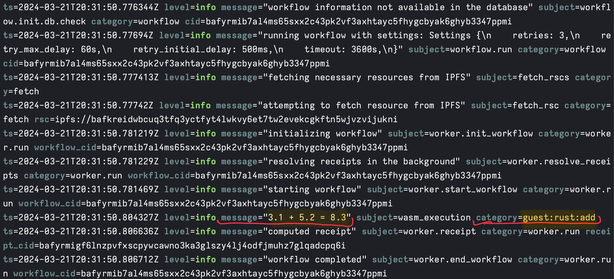

# Writing Functions for Everywhere Computer

This post was published on the [Fission][fission-blog] blog.

_Authors_: [Brian Ginsburg][bgins] and [Zeeshan Lakhani][zeeshan-lakhani]

---

[Everywhere Computer][everywhere-comp] is an emerging decentralized platform that aims to distribute computational tasks across a vast, open network. This network spans from your personal machine to other devices on your LAN, a cluster of cloud nodes, and even to [PoPs (points of presence)][pop] located at the edge of the Internet. Processing happens as close to the data source as possible or scheduled on nodes with general availability or critical resources like sufficiently capable CPUs or GPUs.

At its core, Everywhere Computer is built on the [InterPlanetary Virtual Machine (IPVM)][ipvm] protocol. It executes [workflows][workflows] containing tasks that are [content-addressed][content-addressing]—which means they're uniquely identified by their content rather than by their location. This system is powered by our [Homestar runtime][homestar-runtime], an engine that runs Wasm-based workflows composed of [Wasm components][wasm-component] with runnable functions that can be scheduled and executed by any Homestar peer throughout the network.

Beyond the sandboxing, portability, and predictable performance benefits of Wasm, we're excited about orchestrating workflows and state machines composed of modules compiled from different source languages and bringing them together in workflows where the output of one task feeds into the input of another. Composing components in a workflow lets users focus on component interfaces without having to consider interactions between multiple languages.


With Everywhere Computer, we're all in on "[the return of write once, run anywhere][write-once-run]" as a motto, but with content-addressing and our focus on caching and replayability of previously computed tasks, we can go a step further and say "**write once, run once, and never again (everywhere)**."

With this post, our goal is to introduce authoring Wasm components and, therefore, functions for Everywhere Computer. Wasm components can be authored in [various languages][wit-guest][^1], but we'll focus primarily on Rust, JavaScript, and Python for this post. We'll be writing functions in each of these languages, compiling them to Wasm, packaging them as Wasm components, and bringing them together into a workflow that executes on our compute platform. Along the way, we'll introduce Wasm component tooling, the Homestar runtime, and [Every CLI][everycli], the latter of which provides a convenient interface for running Homestar with a gateway for preparing and executing workflows.

Everywhere Computer is in beta. Everything is publicly available, but we have a closed beta group to provide high-quality support and to gather feedback. [Sign up][beta-signup] for the beta group. We would love to hear what you are working on and how you might use Everywhere Computer!

The code covered in this post is available in the [writing-functions-blogpost-2024][writing-functions-repo] repository.

### Background: Wasm components, WIT, and WASI logging

Evolution within the Wasm ecosystem is happening at a wicked fast pace, particularly now that the [path to Wasm components][path-to-components] has been streamlined and standardized, module-to-module interop is trivial.

In Everywhere Computer, we decided to use the [Canonical ABI][canonical-abi] for converting between the values and functions of Component Model components with those of [Core WebAssembly][core-wasm] modules instead of imposing a custom ABI upon our users. A component is just a wrapper around a core module that specifies its imports, internal definitions, and exports using interfaces defined by the [WIT][wit] IDL format.

Unlike core modules, components may not export Wasm memory, reinforcing Wasm sandboxing and enabling interoperation between languages with different memory assumptions. For example, a component that relies on Wasm-GC (garbage collected) memory compiled from a dynamic language can seamlessly interact with a component compiled from a static language using linear memory.

Everywhere Computer strives for [simplicity][simple-made-easy]. By adopting the Component model and its tooling (for example, [cargo-component][cargo-component] and [wit-bindgen][wit-bindgen]), we can run workflows combining components from different languages without handling incomplete Wasm modules or introducing custom tooling, bindgens, or SDKs for our ecosystem.

In addition, our Homestar runtime utilizes alternate formats as internal [intermediate representations][ir]. By adopting WIT, we can [interpret][wit-to-ipld] between WIT values and other data models at runtime without function writers knowing anything about our internal formats.

#### Embedding Wasmtime

The Homestar runtime embeds the [Wasmtime][wasmtime] runtime to execute Wasm components associated with tasks in a workflow. The Wasmtime runtime is built and maintained by the [Bytecode Alliance][bytecode-alliance]. It provides multi-language support and fine-grained configuration for CPU and memory usage.

Wasmtime is at the forefront of the Wasm ecosystem which includes their support of the WASI stack, which recently reached [WASI Preview 2][wasip2]. WASI gives library developers and implementers, like ourselves, lower-level primitives like files, sockets, and HTTP with a stable set of common interfaces to build on.

We're in good company using Wasmtime. It has already been adopted by platforms and frameworks like [wasmCloud][wasmcloud], [Spin][fermyon-spin], and [Fastly Compute][fastly-compute].

#### WIT

In the following sections, we will use WIT interfaces to define the types of our functions and a [world][wit-world] to describe the imports and exports associated with each Wasm component. Then, we will implement the interfaces in Rust, JavaScript, and Python.

WIT provides built-in types, including primitives like signed/unsigned integer types, floats, strings, and more interesting and complex types like results, options, and lists. WIT also provides a way to define custom, user-defined types like records, variants, and enums. Homestar supports all of these WIT types internally (except [resources][wit-resources], which we do not permit in guest code) when translating between other formats and data structures.

#### WASI Logging

Every CLI reports logs executed by guest programs running on the Homestar host runtime. In order to emit log messages, Homestar implements the [WASI logging WIT proposed interface][wasi-logging] which exposes the `log` method to function writers for integration into their programs. As we'll demonstrate later in this post, when you call `log` in your guest code, Every CLI will display logs in a console at a specified level of verbosity and with contextual information.

In addition, Every CLI provides detailed information that reports workflow events and runtime execution errors.

### Our functions

We will write arithmetic operations in each source language to keep our example code simple. Our Rust program will perform addition and division; the JavaScript one will perform subtraction; and, the Python program will carry out multiplication. We will use division to show division by zero error reporting.

Our functions will be compiled into Wasm components using tools from or built upon the excellent work of the Bytecode Alliance. The Wasm component ecosystem is evolving quickly, so keep in mind that the techniques described in this blog post may be out of date. We'll provide links so you can check on the latest developments.

Clone the [writing-functions-blogpost-2024][writing-functions-repo] repository if you would like to follow along. You will install tooling for each language, build a component from each language, start Every CLI using the components, and run workflows that call the functions in the components.

#### Rust

For Rust, we use [`cargo component`][cargo-component] to generate a Wasm component. `cargo component` imagines what first-class support for WebAssembly components might look like for Rust.

See the [Rust setup][rust-setup] instructions if you are following along.

Rust support includes referencing WIT dependencies in the Cargo manifest. We reference WASI logging in our manifest:

```toml
[package.metadata.component.target.dependencies]
"wasi:logging" = { path = "../wit/deps/logging" }
```

We set our target WIT world in the manifest as well:

```toml
[package.metadata.component.target]
path = "../wit/math.wit"
world = "math"
```

Our WIT interface defines `add` and `divide` functions:

```wit
package fission:math@0.1.0;

world math {
  import wasi:logging/logging;

  export add: func(a: float64, b: float64) -> float64;
  export divide: func(a: float64, b: float64) -> float64;
}
```

`cargo component` generates a set of bindings that produce a `Guest` trait that requires us to implement the interfaces from our WIT world. It also provides an interface for the WASI logging dependency.

Our [Rust source code][rust-src] implements `add` and `divide` with logging for each operation and error reporting when division by zero occurs.

```rust
#[allow(warnings)]
mod bindings;

use bindings::wasi::logging::logging::{log, Level};
use bindings::Guest;

struct Component;

impl Guest for Component {
    fn add(a: f64, b: f64) -> f64 {
        let result = a + b;

        log(
            Level::Info,
            "guest:rust:add",
            format!("{a} + {b} = {result}").as_str(),
        );

        result
    }

    fn divide(a: f64, b: f64) -> f64 {
        if b == 0.0 {
            log(
                Level::Error,
                "guest:rust:divide",
                format!("Division by zero error").as_str(),
            );

            panic!()
        }

        let result = a / b;

        log(
            Level::Info,
            "guest:rust:divide",
            format!("{a} / {b} = {result}").as_str(),
        );

        result
    }
}

bindings::export!(Component with_types_in bindings);
```

`cargo component build` generates the necessary bindings and outputs a `math.wasm` component to the `target/wasm32-wasi/debug` directory. A `cargo component build --release` build outputs to `target/wasm32-wasi/release`.

#### JavaScript

For JavaScript, we use [Homestar Wasmify][homestar-client] to generate a Wasm component. See the [JavaScript Setup][js-setup] instructions if you are following along.

Wasmify is our tool to generate Wasm components from JavaScript code. Wasmify generates Wasm components by bundling JavaScript code, generating WIT types from TypeScript code or JSDoc-defined types, and embedding WASI dependencies. Keep in mind that [Wasmify is in development][wasmify-docs] and does not support all WIT-defined types.

Our [TypeScript source code][ts-src] subtracts two numbers and logs the operation:

```typescript
import { log } from "wasi:logging/logging";

export function subtract(a: number, b: number): number {
  const result = a - b;

  log("info", "guest:javascript:subtract", `${a} - ${b} = ${result}`);

  return result;
}
```

Building a Wasm component from this source code calls Wasmify `build`:

```javascript
import { build } from "@fission-codes/homestar/wasmify";

await build({
  entryPoint: "src/subtract.ts",
  outDir: "output",
});
```

Running this script will produce a Wasm component with a `subtract` name prefix and a hash, for example `subtract-j54di3rspj2eewjro4.wasm`.

Wasmify is built on top of [ComponentizeJS][componentize-js] which ingests JavaScript source code and embeds SpiderMonkey in a Wasm component to run it. Embedding SpiderMonkey and running JavaScript code comes at a size and performance cost compared to languages that can compile to WebAssembly directly, but it is necessary to provide a JavaScript environment.

See [Making JavaScript run fast on WebAssembly][javascript-webassembly-post] for more information.

#### Python

For Python, we use [componentize-py][componentize-py] to generate a Wasm component. See the [Python Setup][python-setup] instructions if you are following along.

Our WIT interface defines a `multiply` function:

```wit
package fission:math@0.1.0;

world multiplication {
  import wasi:logging/logging;

  export multiply: func(a: float64, b: float64) -> float64;
}
```

`componentize-py` generates a set of bindings to import in our Python source code. Unlike Rust, the bindings do not need to be written to a file and can be generated on the fly.

Our [Python source code][python-src] multiplies two numbers and logs the operation:

```python
import multiplication
from multiplication.imports.logging import (log, Level)

class Multiplication(multiplication.Multiplication):
    def multiply(self, a, b) -> float:
        result = a * b

        log(Level.INFO, 'guest:python:multiply', '{} * {} = {}'.format(a, b, result))

        return a * b
```

We run `componentize-py` to generate our Wasm component:

```sh
componentize-py -d ../wit -w multiplication componentize app -o output/multiply.wasm
```

The `-d` option tells `componentize-py` where to look for our WIT interfaces and `-w` tells it which WIT world to use. The `componentize` command takes the name of the Python module containing the app to wrap. In our case, we are targeting `app.py`.

`componentize-py` bundles `CPython`, `libc`, and other dependencies into the Wasm component to interpret and provide a Python environment for our code. Like JavaScript, this comes at a size and performance cost but is necessary to run Python code.

We recommend reading the [Introducing Componentize-Py][introducing-componentize-py-blog] blog post for more information on writing Python-sourced components.
Also, the [Introducing Componentize-Py: A Tool for Packaging Python Apps as Components][introducing-componentize-py-video] is an excellent talk that explains how `componentize-py` works.

### IPFS

Homestar and Everywhere Computer currently use [IPFS Kubo][kubo] as a storage layer. Before we start into the next section, [install IPFS Kubo][install-ipfs] and start the IPFS daemon:

```sh
ipfs daemon
```

The daemon should start an RPC API on port `5001`.

### Workflows

We now have a set of Wasm components with arithmetic functions sourced from multiple languages. Our next step is to run these functions together in [workflows][workflows].

Every CLI starts a gateway that loads Wasm components onto IPFS, prepares workflows, and calls on the Homestar runtime to schedule and execute them. Install [Every CLI][every-cli-npm], then we'll write a workflow.

```sh
npm i -g @everywhere-computer/every-cli
```

Every CLI provides a simplified workflow syntax that it uses to prepare the underlying workflow. Let's start by using `math.wasm` to add two numbers:

```json
{
  "tasks": [
    {
      "run": {
        "name": "add",
        "input": {
          "args": [3.1, 5.2],
          "func": "add"
        }
      }
    }
  ]
}
```

A workflow is an array of tasks that we would like to execute. Each task is given a `name` which will be used to reference results in subsequent tasks. Our task `input` includes the name of the function to execute and the arguments to the function.

Let's run this workflow! Start Every CLI with `math.wasm` as an argument:

```sh
every dev --fn rust/target/wasm32-wasi/release/math.wasm
```

Every CLI starts a gateway that we can query for a JSON Schema representing the WIT interfaces in `math.wasm` at `localhost:3000`.

Post the workflow to the gateway:

```sh
curl localhost:3000/run --json @workflows/add.json
```

The response reports the result of adding `3.1` and `5.2` as `8.3`.

In addition, Every CLI has passed along logs from the Homestar runtime:



The logs report information about workflow execution and include our WASI logs. Our WASI log reports `"3.1 + 5.2 = 8.3"` with the category `guest:rust:add`. WASI logs always have the `wasm_execution` subject.

We can also see workflow settings, fetching resources (our Wasm components), initializing, starting, and completing the workflow. The "resolving receipts" log shows that Homestar is looking for cached results so it can avoid work where possible. The "computed receipt" log reports the [CID][cid], a content identifier derived from the content's cryptographic hash, of the receipt from the add computation. Every CLI returns the workflow result, but the computed receipts can be also used to pull results directly from IPFS by CID.

If we post the workflow to the gateway again, we see a different set of logs:


This time we don't need to do any work. Homestar cached the receipts from our last run and reports that it is replaying the workflow and its receipts.

Notice also that our WASI log does not show up. WASI logging only happens on execution, not replay. We'll see in a moment how we can force re-execution to always see WASI logs.

Let's try a workflow that uses all four arithmetic operations from our Rust, JavaScript, and Python-sourced components:

```json
{
  "tasks": [
    {
      "run": {
        "name": "add",
        "input": {
          "args": [3.1, 5.2],
          "func": "add"
        }
      }
    },
    {
      "run": {
        "name": "subtract",
        "input": {
          "args": ["{{needs.add.output}}", 4.4],
          "func": "subtract"
        }
      }
    },
    {
      "run": {
        "name": "multiply",
        "input": {
          "args": ["{{needs.subtract.output}}", 2.3],
          "func": "multiply"
        }
      }
    },
    {
      "run": {
        "name": "divide",
        "input": {
          "args": ["{{needs.multiply.output}}", 1.5],
          "func": "divide"
        }
      }
    }
  ]
}
```

In this workflow, each task except the first receives input from the previous task. For example, `subtract` awaits the output of `add` by using `"{{needs.add.output}}"` as a placeholder that will be filled in when `add` has completed.

Restart Every CLI, passing in all of our Wasm components:

```sh
every dev --fn rust/target/wasm32-wasi/release/math.wasm --fn javascript/output/subtract-j54di3rspj2eewjro4.wasm --fn python/output/multiply.wasm --debug
```

The hash of your subtract Wasm component may be different. Check `javascript/output` for the appropriate file name.

We use the `--debug` flag this time to force re-execution of the tasks in our workflow. The `--debug` flag lets us see our WASI logs on every run while we are developing our functions, but should not be used in production because it eliminates the benefits of caching.

Post this workflow:

```sh
curl localhost:3000/run --json @workflows/all.json
```

The response reports a result of `5.98` which looks close enough for computer math!

Our WASI logging reports each operation:


We can see WASI logs from each of our components, labeled by category as `guest:rust:add`, `guest:javascript:subtract`, `guest:python:multiply`, and `guest:rust:divide`.

Lastly, a workflow that attempts division by zero to check our error reporting.

```json
{
  "tasks": [
    {
      "run": {
        "name": "divide",
        "input": {
          "args": [3.1, 0.0],
          "func": "divide"
        }
      }
    }
  ]
}
```

On running this workflow, we see two errors:


The first error is our WASI log reporting a "Division by zero error". The second error is an execution error from the Wasm runtime. It's a bit inscrutable, but we can see "not able to run fn divide" which tells us which function failed.

### Conclusion

In this post, we have introduced Everywhere Computer and how you can write functions and workflows for it. This post should be enough to get you started writing your functions.

We have much more to share. For example, you may have noticed that Every CLI starts a Control Panel:


We will write about the Control Panel, offloading compute to other nodes in a network based on their capability or a scheduling policy, and working with non-determinism like network requests and persistent state in a workflow in future posts.

#### Acknowledgements

We'd like to offer heartfelt thanks to those developing Wasmtime, ComponentizeJS, Componentize-Py, and the many tools available throughout the Wasm ecosystem. We're ecstatic to be part of this community and to be building on top of these platforms. Special thanks are due to the [Fission team][fission-team], [Alex Crichton][alex-crichton], [Guy Bedford][guy-bedford], [Joel Dice][joel-dice], [Pat Hickey][pat-hickey], [James Dennis][james-dennis], [Paul Cleary][paul-cleary], and the many others who have helped us along the way.

[^1]: Other supported languages include C/C++, Java (TeaVM Java), Go (TinyGo), and C#.

[alex-crichton]: https://github.com/alexcrichton
[aws-step-fn]: https://aws.amazon.com/step-functions/
[beta-signup]: https://docs.google.com/forms/d/e/1FAIpQLSfREjmoTBOW2gyUSFypn3omifibvptH0K_IQwtFWiGORU5vAQ/viewform
[bgins]: https://github.com/bgins
[bytecode-alliance]: https://bytecodealliance.org/
[canonical-abi]: https://github.com/WebAssembly/component-model/blob/main/design/mvp/CanonicalABI.md
[cargo-component]: https://github.com/bytecodealliance/cargo-component
[cid]: https://docs.ipfs.tech/concepts/content-addressing/
[componentize-js]: https://github.com/bytecodealliance/ComponentizeJS
[componentize-py]: https://github.com/bytecodealliance/componentize-py
[content-addressing]: https://en.wikipedia.org/wiki/Content-addressable_storage
[core-wasm]: https://webassembly.github.io/spec/core/
[everycli]: https://docs.everywhere.computer/everycli/
[every-cli-npm]: https://www.npmjs.com/package/@everywhere-computer/every-cli
[everywhere-comp]: https://everywhere.computer/
[fastly-compute]: https://www.fastly.com/products/compute
[fermyon-spin]: https://www.fermyon.com/spin
[fission-blog]: https://fission.codes/blog/
[fission-team]: https://fission.codes/team/
[guy-bedford]: https://github.com/guybedford
[homestar-client]: https://www.npmjs.com/package/@fission-codes/homestar
[homestar-config]: https://docs.everywhere.computer/homestar/configuration/
[homestar-runtime]: https://github.com/ipvm-wg/homestar/blob/main/README.md
[install-ipfs]: https://docs.ipfs.tech/install/command-line/#install-official-binary-distributions
[introducing-componentize-py-blog]: https://www.fermyon.com/blog/introducing-componentize-py
[introducing-componentize-py-video]: https://www.youtube.com/watch?v=PkAO17lmqsI
[ipfs]: https://ipfs.tech/
[ipvm]: https://fission.codes/ecosystem/ipvm/
[ir]: https://en.wikipedia.org/wiki/Intermediate_representation
[james-dennis]: https://jmsdnns.com/
[javascript-webassembly-post]: https://bytecodealliance.org/articles/making-javascript-run-fast-on-webassembly
[js-setup]: https://github.com/everywhere-computer/writing-functions-blogpost-2024/tree/main/javascript#setup
[joel-dice]: https://github.com/dicej
[kubo]: https://docs.ipfs.tech/how-to/command-line-quick-start/
[paul-cleary]: https://github.com/pauljamescleary
[pat-hickey]: https://github.com/pchickey
[path-to-components]: https://youtu.be/phodPLY8zNE
[pop]: https://en.wikipedia.org/wiki/Point_of_presence
[python-setup]: https://github.com/everywhere-computer/writing-functions-blogpost-2024/tree/main/python#setup
[python-src]: https://github.com/everywhere-computer/writing-functions-blogpost-2024/blob/main/python/app.py
[rust-setup]: https://github.com/everywhere-computer/writing-functions-blogpost-2024/tree/main/rust#setup
[rust-src]: https://github.com/everywhere-computer/writing-functions-blogpost-2024/blob/main/rust/src/lib.rs
[simple-made-easy]: https://www.infoq.com/presentations/Simple-Made-Easy/
[ts-src]: https://github.com/everywhere-computer/writing-functions-blogpost-2024/blob/main/javascript/src/subtract.ts
[wasi-logging]: https://github.com/WebAssembly/wasi-logging/tree/main
[wasm-component]: https://component-model.bytecodealliance.org/
[wasmify-docs]: https://docs.everywhere.computer/everycli/#wasmify
[wasip2]: https://blog.sunfishcode.online/wasi-0-2/
[wasmtime]: https://docs.wasmtime.dev/
[wasmcloud]: https://wasmcloud.com/blog/wasmtime-a-standardized-runtime-for-wasmcloud
[wit]: https://github.com/WebAssembly/component-model/blob/main/design/mvp/WIT.md
[wit-bindgen]: https://github.com/bytecodealliance/wit-bindgen
[wit-guest]: https://github.com/bytecodealliance/wit-bindgen?tab=readme-ov-file#supported-guest-languages
[wit-to-ipld]: https://github.com/ipvm-wg/homestar/tree/main/homestar-wasm#interpreting-between-ipld-and-wit
[wit-resources]: https://component-model.bytecodealliance.org/design/wit.html#resources
[wit-world]: https://component-model.bytecodealliance.org/design/wit.html#worlds
[workflows]: https://aws.amazon.com/what-is/workflow/
[write-once-run]: https://youtu.be/dhoVlVu2XAw?si=x1YIQk-9Jkg_FphP
[writing-functions-repo]: https://github.com/everywhere-computer/writing-functions-blogpost-2024
[zeeshan-lakhani]: https://zee.town/
